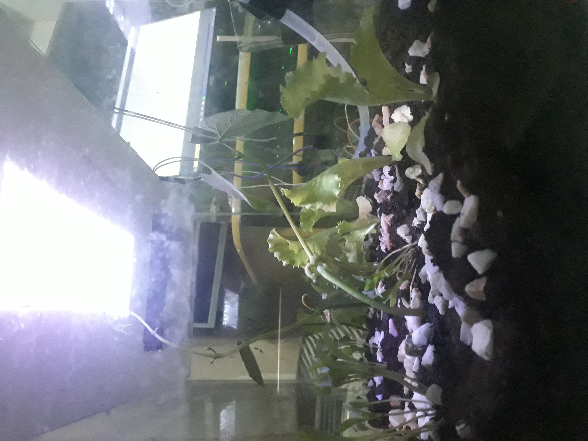

# Projeto de Arduino

  Economia de água no desenvolvimento de plantas em ambiente controlado ou ciclico.

### Materiais:
* Arduino Uno.
* Protoboard.
* Modulo DHT11.
* Boma d'agua.
* Leds e Resistores.
* Cooler.
* Bateria.
* Mangueira.
* Isopor.
* Sementes.

### Resultado:
  
- Plantas que cresceram em ambiente controlado utilizaram 50% menos água para atingir a mesma maturidade de plantas desenvolvidas em ambiente aberto.
- Plantas que cresceram em ambiente fechado ciclando a própria água utilizaram 75% menos água.

### Sketch:

"Não disponível ainda"

### Imagens:

#### Montando a iluminação

#### Planta clicando em ambiente fechado

#### Planta em ambiente controlado (Temperatura, ventilação, iluminação e humidade).

