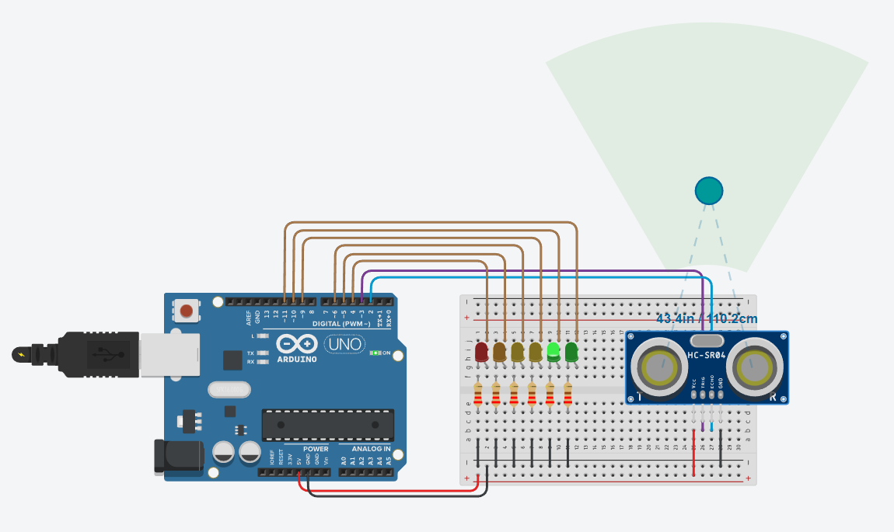

# Projeto de Arduino

  Sensor de distância com auxilio visual por leds.

### Materiais:
* Arduino Uno.
* Protoboard.
* Modulo  HC-SR04.
* Leds e Resistores.

### Tinkercad
  Tinkercad Circuits is the easiest way to get your students started with learning electronics. Using our interactive circuit editor, students can explore, connect, and code virtual projects with a bottomless toolbox of simulated components.

*Link:* https://www.tinkercad.com/learn/circuits

### Sketch:

### Link:

https://www.tinkercad.com/things/kq9ZWaPNn0N?sharecode=p4neQUrqpe3En1HJDx5nw71ccAoUBATejE7Te41oCp4