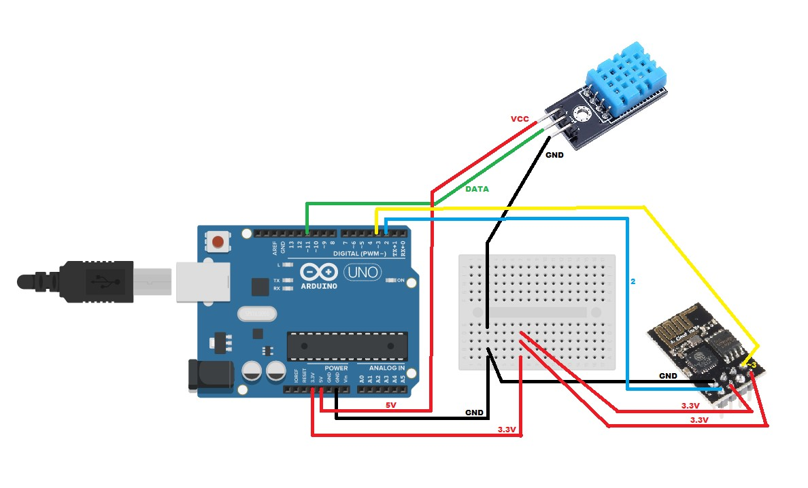

# Projeto de Arduino

  Leitura de Umidade e Temperatura utilizando Arduino Uno.

### Materiais:
* Arduino Uno.
* Protoboard.
* Modulo DHT11.
* Modulo Wifi ESP8266.

### ThingSpeak 
  ThingSpeak is an open-source software written in Ruby which allows users to communicate 
with internet enabled devices. It facilitates data access, retrieval and logging of data 
by providing an API to both the devices and social network websites.

*Link:* https://thingspeak.com/

### Sketch:

### Resultado:

